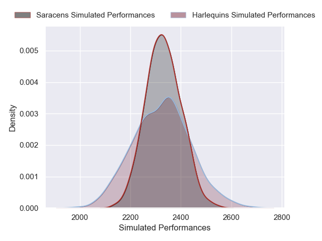

---  
layout: page  
title: Harlequins V Saracens on 2025/11/16  
date: 2025-11-16  
categories: "Premiership Rugby Cup 25/26" match projection  
---
# Harlequins V Saracens on 2025/11/16, 21.0 to 46.0

# Club Level Predictions

Now that the game has been played, lets see how the club predictions did. I predicted Harlequins to win by 0.02, and Saracens won by 25.0. That's an absolute error of 25.0 for the margin of victory, while my average absolute error has been 13.8 over the past six months. This prediction was more accurate than 15.7% of my recent predictions.

For the Over/Under model, I predicted a total of 57.5 and we have an actual total of 67.0. That's an absolute error of 9.5 compared to a six month average of 13.2. This prediction was more accurate than 54.3% of my recent predictions.
## Projected Performances - Club Model

## Projected Spreads - Club Model

## Projected Results - Club Model

