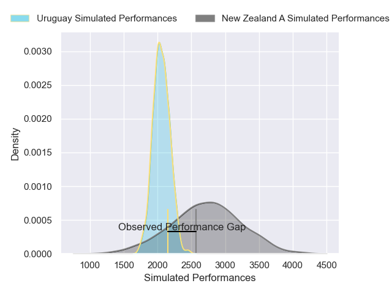
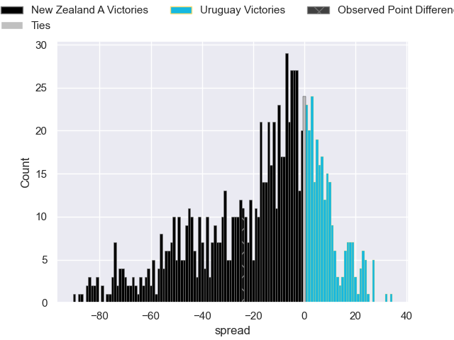

---  
layout: page  
title: New Zealand A V Uruguay on 2025/11/16  
date: 2025-11-16  
categories: "Test Matchs 2025" match projection  
---
# New Zealand A V Uruguay on 2025/11/16, 45.0 to 21.0

# Club Level Predictions

Now that the game has been played, lets see how the club predictions did. I predicted New Zealand A to win by 17.45, and New Zealand A won by 24.0. That's an absolute error of 6.6 for the margin of victory, while my average absolute error has been 13.8 over the past six months. This prediction was more accurate than 67.1% of my recent predictions.

For the Over/Under model, I predicted a total of 54.5 and we have an actual total of 66.0. That's an absolute error of 11.5 compared to a six month average of 13.1. This prediction was more accurate than 48.1% of my recent predictions.
## Projected Performances - Club Model

## Projected Spreads - Club Model

## Projected Results - Club Model

