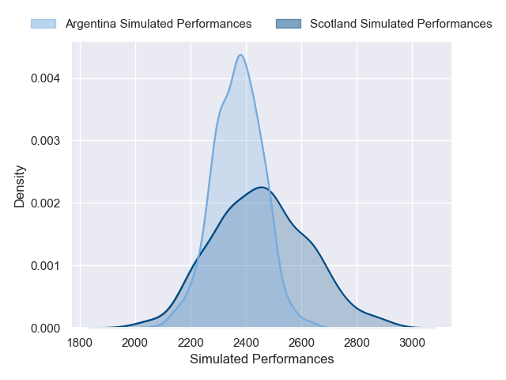
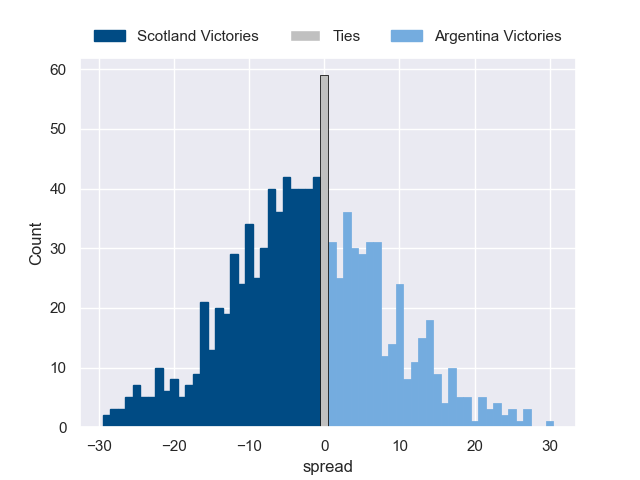

---  
layout: page  
title: Scotland V Argentina on 2025/11/16  
date: 2025-11-16  
categories: "International Test Match 2025" match projection  
---
# Scotland V Argentina on 2025/11/16, 24.0 to 33.0

# Club Level Predictions

Now that the game has been played, lets see how the club predictions did. I predicted Scotland to win by 2.48, and Argentina won by 9.0. That's an absolute error of 11.5 for the margin of victory, while my average absolute error has been 13.8 over the past six months. This prediction was more accurate than 45.8% of my recent predictions.

For the Over/Under model, I predicted a total of 55.5 and we have an actual total of 57.0. That's an absolute error of 1.5 compared to a six month average of 13.1. This prediction was more accurate than 92.2% of my recent predictions.
## Projected Performances - Club Model

## Projected Spreads - Club Model

## Projected Results - Club Model

