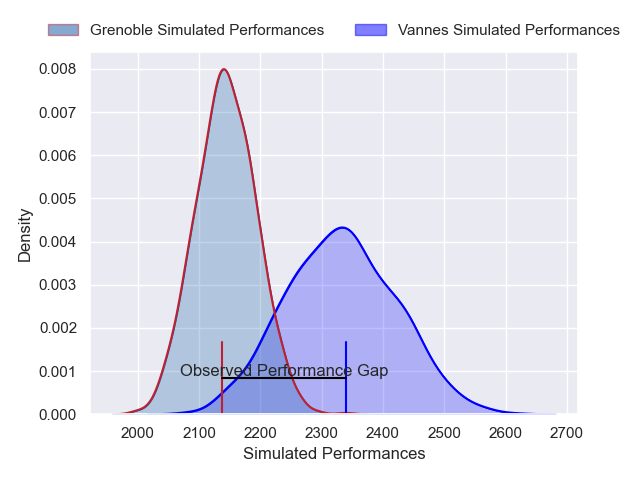
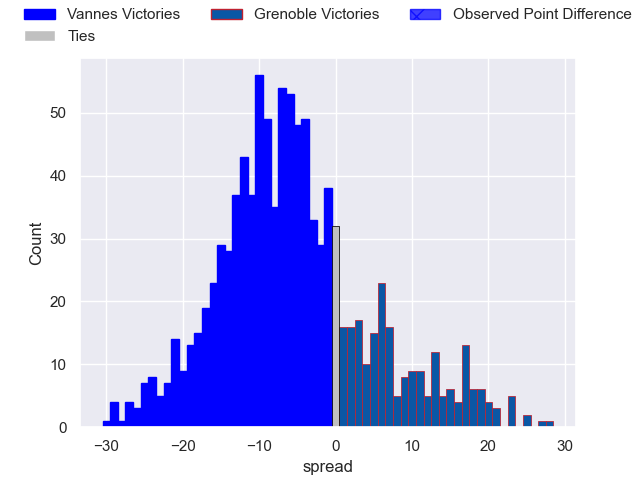

---  
layout: page  
title: Vannes V Grenoble on 2025/11/16  
date: 2025-11-16  
categories: "Pro D2 25/26" match projection  
---
# Vannes V Grenoble on 2025/11/16, 28.0 to 18.0

# Club Level Predictions

Now that the game has been played, lets see how the club predictions did. I predicted Vannes to win by 5.51, and Vannes won by 10.0. That's an absolute error of 4.5 for the margin of victory, while my average absolute error has been 13.8 over the past six months. This prediction was more accurate than 76.0% of my recent predictions.

For the Over/Under model, I predicted a total of 47.5 and we have an actual total of 46.0. That's an absolute error of 1.5 compared to a six month average of 13.1. This prediction was more accurate than 92.2% of my recent predictions.
## Projected Performances - Club Model

## Projected Spreads - Club Model

## Projected Results - Club Model

