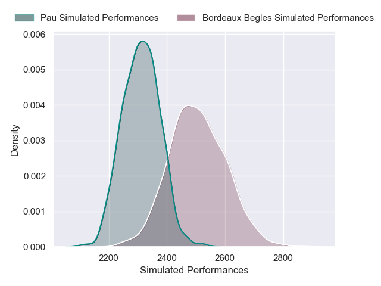
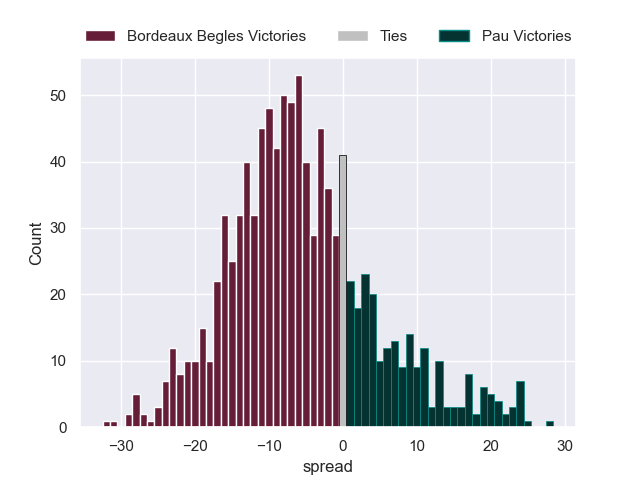

---  
layout: page  
title: Bordeaux Begles V Pau on 2025/11/21  
date: 2025-11-21  
categories: "Top 14 25/26" match projection  
---
# Bordeaux Begles V Pau on 2025/11/21, 33.0 to 34.0

# Club Level Predictions

Now that the game has been played, lets see how the club predictions did. I predicted Bordeaux Begles to win by 4.88, and Pau won by 1.0. That's an absolute error of 5.9 for the margin of victory, while my average absolute error has been 13.7 over the past six months. This prediction was more accurate than 69.7% of my recent predictions.

For the Over/Under model, I predicted a total of 47.5 and we have an actual total of 67.0. That's an absolute error of 19.5 compared to a six month average of 13.0. This prediction was more accurate than 23.3% of my recent predictions.
## Projected Performances - Club Model

## Projected Spreads - Club Model

## Projected Results - Club Model

