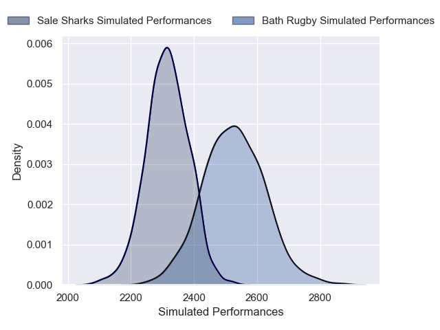
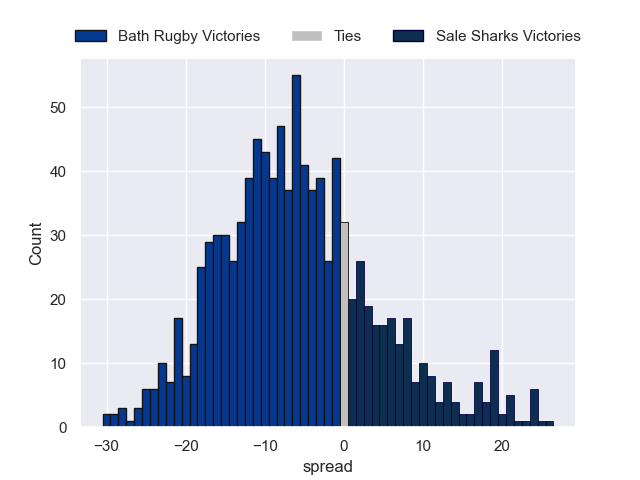

---  
layout: page  
title: Bath Rugby V Sale Sharks on 2025/11/22  
date: 2025-11-22  
categories: "Premiership Rugby Cup 25/26" match projection  
---
# Bath Rugby V Sale Sharks on 2025/11/22, 20.0 to 0.0

# Club Level Predictions

Now that the game has been played, lets see how the club predictions did. I predicted Bath Rugby to win by 6.71, and Bath Rugby won by 20.0. That's an absolute error of 13.3 for the margin of victory, while my average absolute error has been 13.7 over the past six months. This prediction was more accurate than 38.5% of my recent predictions.

For the Over/Under model, I predicted a total of 51.5 and we have an actual total of 20.0. That's an absolute error of 31.5 compared to a six month average of 13.0. This prediction was more accurate than 5.3% of my recent predictions.
## Projected Performances - Club Model

## Projected Spreads - Club Model

## Projected Results - Club Model

