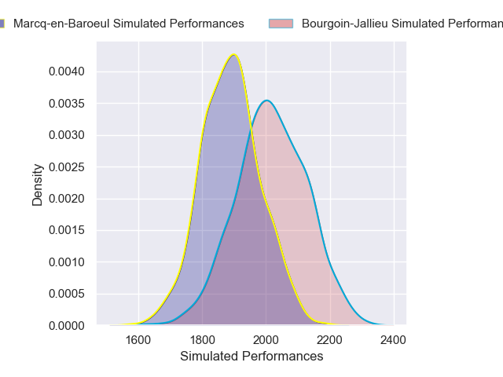
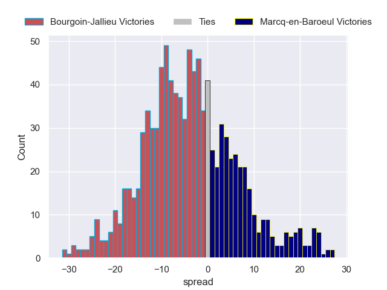

---  
layout: page  
title: Bourgoin-Jallieu V Marcq-en-Baroeul on 2025/11/22  
date: 2025-11-22  
categories: "Nationale 25/26" match projection  
---
# Bourgoin-Jallieu V Marcq-en-Baroeul on 2025/11/22, 20.0 to 9.0

# Club Level Predictions

Now that the game has been played, lets see how the club predictions did. I predicted Bourgoin-Jallieu to win by 4.17, and Bourgoin-Jallieu won by 11.0. That's an absolute error of 6.8 for the margin of victory, while my average absolute error has been 13.8 over the past six months. This prediction was more accurate than 65.4% of my recent predictions.

For the Over/Under model, I predicted a total of 42.5 and we have an actual total of 29.0. That's an absolute error of 13.5 compared to a six month average of 13.1. This prediction was more accurate than 39.8% of my recent predictions.
## Projected Performances - Club Model

## Projected Spreads - Club Model

## Projected Results - Club Model

