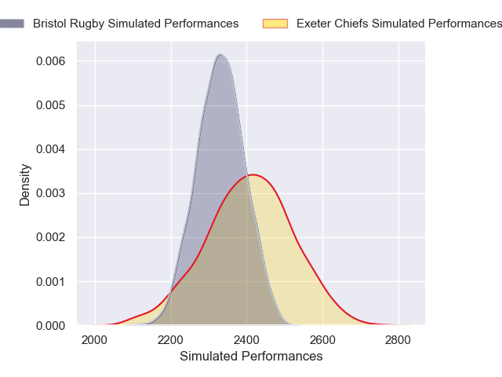
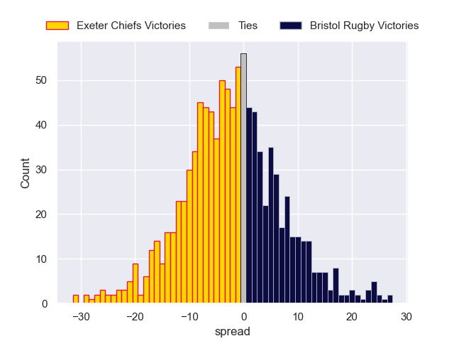

---  
layout: page  
title: Exeter Chiefs V Bristol Bears on 2025/11/22  
date: 2025-11-22  
categories: "Premiership Rugby Cup 25/26" match projection  
---
# Exeter Chiefs V Bristol Bears on 2025/11/22, 22.0 to 17.0

# Club Level Predictions

Now that the game has been played, lets see how the club predictions did. I predicted Exeter Chiefs to win by 3.02, and Exeter Chiefs won by 5.0. That's an absolute error of 2.0 for the margin of victory, while my average absolute error has been 13.7 over the past six months. This prediction was more accurate than 89.0% of my recent predictions.

For the Over/Under model, I predicted a total of 53.5 and we have an actual total of 39.0. That's an absolute error of 14.5 compared to a six month average of 13.1. This prediction was more accurate than 36.5% of my recent predictions.
## Projected Performances - Club Model

## Projected Spreads - Club Model

## Projected Results - Club Model

