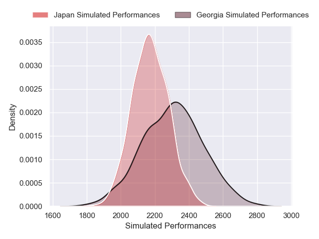
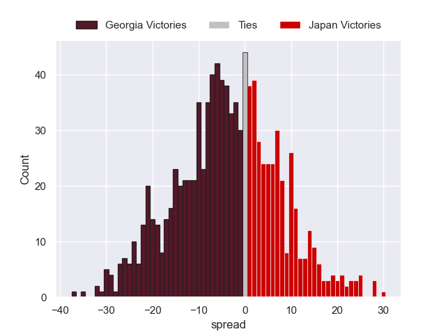

---  
layout: page  
title: Georgia V Japan on 2025/11/22  
date: 2025-11-22  
categories: "Test Matchs 2025" match projection  
---
# Georgia V Japan on 2025/11/22, 23.0 to 25.0

# Club Level Predictions

Now that the game has been played, lets see how the club predictions did. I predicted Georgia to win by 4.0, and Japan won by 2.0. That's an absolute error of 6.0 for the margin of victory, while my average absolute error has been 13.7 over the past six months. This prediction was more accurate than 68.8% of my recent predictions.

For the Over/Under model, I predicted a total of 54.5 and we have an actual total of 48.0. That's an absolute error of 6.5 compared to a six month average of 13.1. This prediction was more accurate than 68.8% of my recent predictions.
## Projected Performances - Club Model

## Projected Spreads - Club Model

## Projected Results - Club Model

