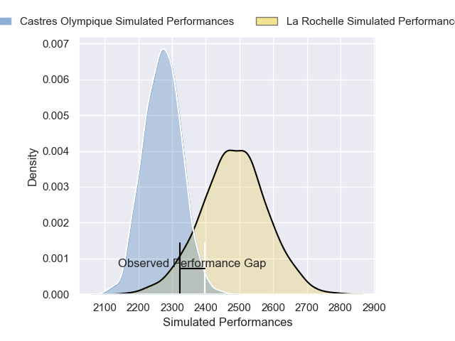
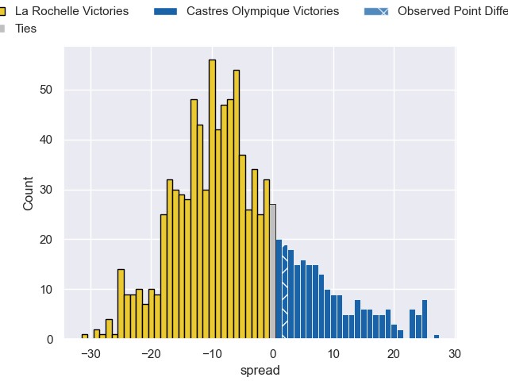
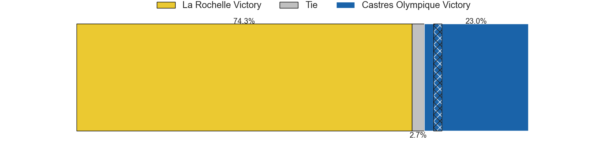

---  
layout: page  
title: La Rochelle V Castres Olympique on 2025/11/22  
date: 2025-11-22  
categories: "Top 14 25/26" match projection  
---
# La Rochelle V Castres Olympique on 2025/11/22, 17.0 to 19.0

# Club Level Predictions

Now that the game has been played, lets see how the club predictions did. I predicted La Rochelle to win by 6.16, and Castres Olympique won by 2.0. That's an absolute error of 8.2 for the margin of victory, while my average absolute error has been 13.7 over the past six months. This prediction was more accurate than 59.1% of my recent predictions.

For the Over/Under model, I predicted a total of 49.5 and we have an actual total of 36.0. That's an absolute error of 13.5 compared to a six month average of 13.1. This prediction was more accurate than 39.8% of my recent predictions.
## Projected Performances - Club Model

## Projected Spreads - Club Model

## Projected Results - Club Model

