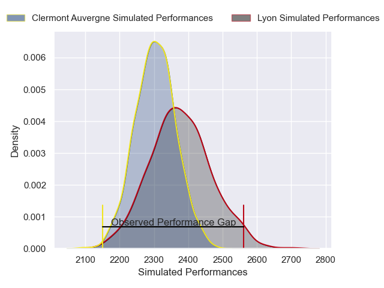

---  
layout: page  
title: Lyon V Clermont Auvergne on 2025/11/22  
date: 2025-11-22  
categories: "Top 14 25/26" match projection  
---
# Lyon V Clermont Auvergne on 2025/11/22, 43.0 to 24.0

# Club Level Predictions

Now that the game has been played, lets see how the club predictions did. I predicted Lyon to win by 2.4, and Lyon won by 19.0. That's an absolute error of 16.6 for the margin of victory, while my average absolute error has been 13.8 over the past six months. This prediction was more accurate than 30.5% of my recent predictions.

For the Over/Under model, I predicted a total of 53.5 and we have an actual total of 67.0. That's an absolute error of 13.5 compared to a six month average of 13.1. This prediction was more accurate than 39.8% of my recent predictions.
## Projected Performances - Club Model

## Projected Spreads - Club Model

## Projected Results - Club Model

