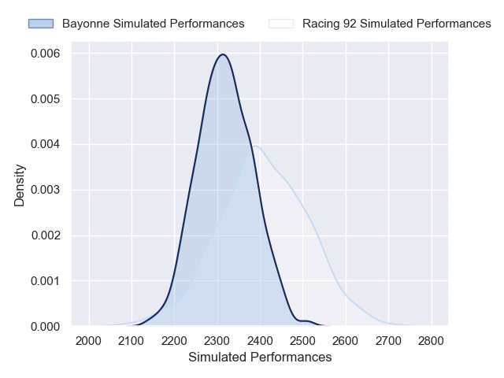
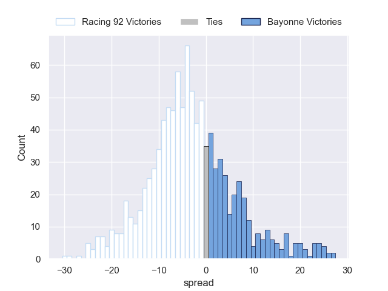
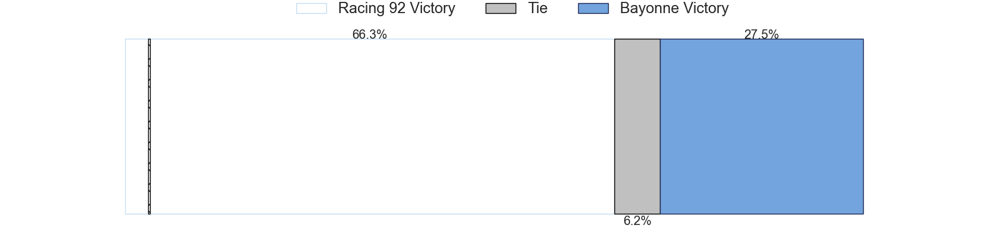

---  
layout: page  
title: Racing 92 V Bayonne on 2025/11/22  
date: 2025-11-22  
categories: "Top 14 25/26" match projection  
---
# Racing 92 V Bayonne on 2025/11/22, 47.0 to 27.0

# Club Level Predictions

Now that the game has been played, lets see how the club predictions did. I predicted Racing 92 to win by 4.28, and Racing 92 won by 20.0. That's an absolute error of 15.7 for the margin of victory, while my average absolute error has been 13.7 over the past six months. This prediction was more accurate than 32.4% of my recent predictions.

For the Over/Under model, I predicted a total of 47.5 and we have an actual total of 74.0. That's an absolute error of 26.5 compared to a six month average of 13.0. This prediction was more accurate than 10.3% of my recent predictions.
## Projected Performances - Club Model

## Projected Spreads - Club Model

## Projected Results - Club Model

