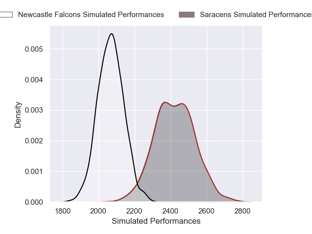
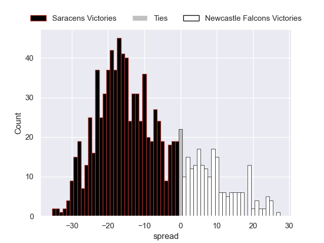

---  
layout: page  
title: Saracens V Newcastle Falcons on 2025/11/22  
date: 2025-11-22  
categories: "Premiership Rugby Cup 25/26" match projection  
---
# Saracens V Newcastle Falcons on 2025/11/22, 43.0 to 0.0

# Club Level Predictions

Now that the game has been played, lets see how the club predictions did. I predicted Saracens to win by 10.89, and Saracens won by 43.0. That's an absolute error of 32.1 for the margin of victory, while my average absolute error has been 13.8 over the past six months. This prediction was more accurate than 8.2% of my recent predictions.

For the Over/Under model, I predicted a total of 60.5 and we have an actual total of 43.0. That's an absolute error of 17.5 compared to a six month average of 13.1. This prediction was more accurate than 27.3% of my recent predictions.
## Projected Performances - Club Model

## Projected Spreads - Club Model

## Projected Results - Club Model

