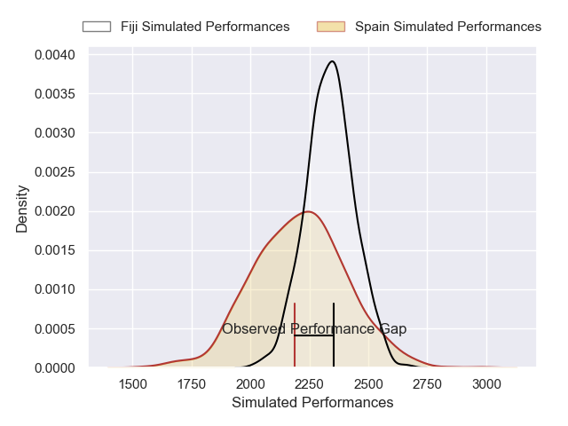
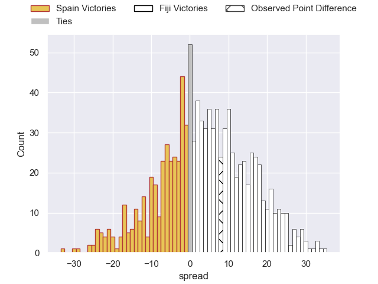

---  
layout: page  
title: Spain V Fiji on 2025/11/22  
date: 2025-11-22  
categories: "Test Matchs 2025" match projection  
---
# Spain V Fiji on 2025/11/22, 33.0 to 41.0

# Club Level Predictions

Now that the game has been played, lets see how the club predictions did. I predicted Fiji to win by 3.54, and Fiji won by 8.0. That's an absolute error of 4.5 for the margin of victory, while my average absolute error has been 13.8 over the past six months. This prediction was more accurate than 76.2% of my recent predictions.

For the Over/Under model, I predicted a total of 62.5 and we have an actual total of 74.0. That's an absolute error of 11.5 compared to a six month average of 13.1. This prediction was more accurate than 47.4% of my recent predictions.
## Projected Performances - Club Model

## Projected Spreads - Club Model

## Projected Results - Club Model

