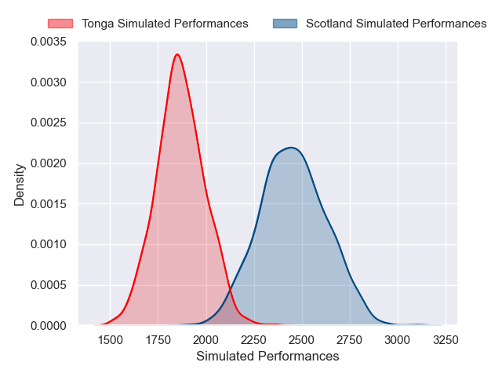
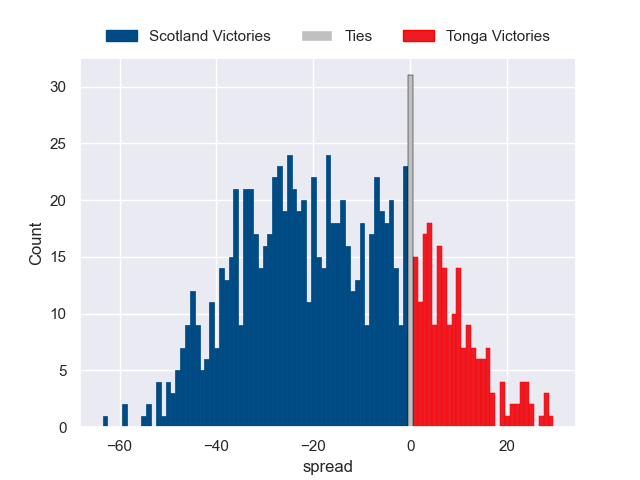

---  
layout: page  
title: Scotland V Tonga on 2025/11/23  
date: 2025-11-23  
categories: "International Test Match 2025" match projection  
---
# Scotland V Tonga on 2025/11/23, 56.0 to 0.0

# Club Level Predictions

Now that the game has been played, lets see how the club predictions did. I predicted Scotland to win by 14.51, and Scotland won by 56.0. That's an absolute error of 41.5 for the margin of victory, while my average absolute error has been 13.8 over the past six months. This prediction was more accurate than 3.8% of my recent predictions.

For the Over/Under model, I predicted a total of 59.5 and we have an actual total of 56.0. That's an absolute error of 3.5 compared to a six month average of 13.1. This prediction was more accurate than 83.3% of my recent predictions.
## Projected Performances - Club Model

## Projected Spreads - Club Model

## Projected Results - Club Model

