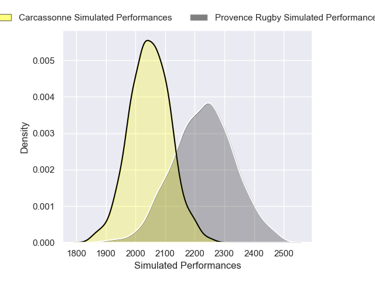
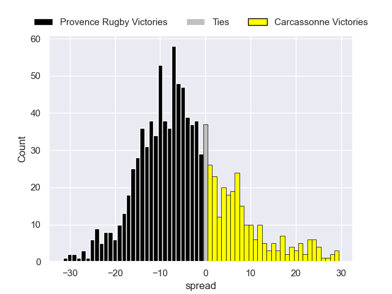

---  
layout: page  
title: Provence Rugby V Carcassonne on 2025/11/28  
date: 2025-11-28  
categories: "Pro D2 25/26" match projection  
---
# Provence Rugby V Carcassonne on 2025/11/28, 48.0 to 16.0

# Club Level Predictions

Now that the game has been played, lets see how the club predictions did. I predicted Provence Rugby to win by 6.34, and Provence Rugby won by 32.0. That's an absolute error of 25.7 for the margin of victory, while my average absolute error has been 13.9 over the past six months. This prediction was more accurate than 15.6% of my recent predictions.

For the Over/Under model, I predicted a total of 43.5 and we have an actual total of 64.0. That's an absolute error of 20.5 compared to a six month average of 13.1. This prediction was more accurate than 20.7% of my recent predictions.
## Projected Performances - Club Model

## Projected Spreads - Club Model

## Projected Results - Club Model

