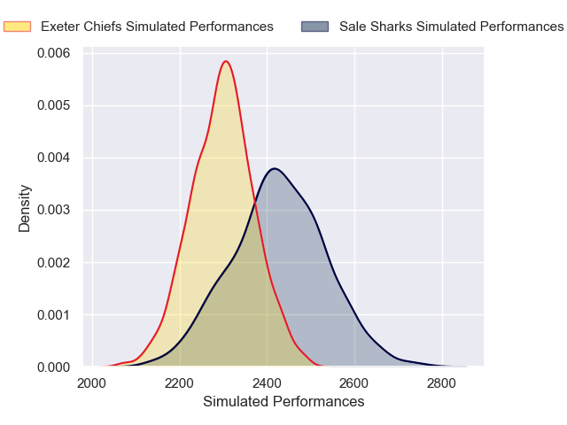
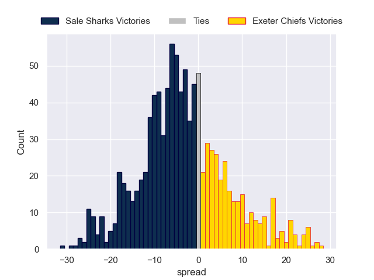

---  
layout: page  
title: Sale Sharks V Exeter Chiefs on 2025/11/28  
date: 2025-11-28  
categories: "Gallagher Premiership 25/26" match projection  
---
# Sale Sharks V Exeter Chiefs on 2025/11/28, 26.0 to 27.0

# Club Level Predictions

Now that the game has been played, lets see how the club predictions did. I predicted Sale Sharks to win by 3.39, and Exeter Chiefs won by 1.0. That's an absolute error of 4.4 for the margin of victory, while my average absolute error has been 13.9 over the past six months. This prediction was more accurate than 76.7% of my recent predictions.

For the Over/Under model, I predicted a total of 48.5 and we have an actual total of 53.0. That's an absolute error of 4.5 compared to a six month average of 13.1. This prediction was more accurate than 78.0% of my recent predictions.
## Projected Performances - Club Model

## Projected Spreads - Club Model

## Projected Results - Club Model

