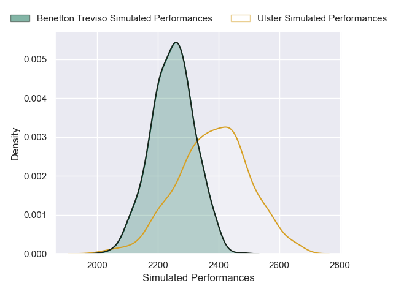
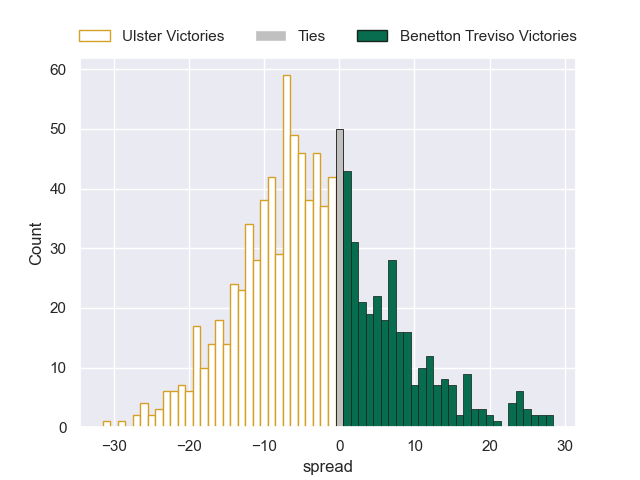

---  
layout: page  
title: Ulster V Benetton Treviso on 2025/11/28  
date: 2025-11-28  
categories: "United Rugby Championship 25/26" match projection  
---
# Ulster V Benetton Treviso on 2025/11/28, 47.0 to 13.0

# Club Level Predictions

Now that the game has been played, lets see how the club predictions did. I predicted Ulster to win by 4.02, and Ulster won by 34.0. That's an absolute error of 30.0 for the margin of victory, while my average absolute error has been 13.9 over the past six months. This prediction was more accurate than 10.4% of my recent predictions.

For the Over/Under model, I predicted a total of 51.5 and we have an actual total of 60.0. That's an absolute error of 8.5 compared to a six month average of 13.1. This prediction was more accurate than 59.3% of my recent predictions.
## Projected Performances - Club Model

## Projected Spreads - Club Model

## Projected Results - Club Model

