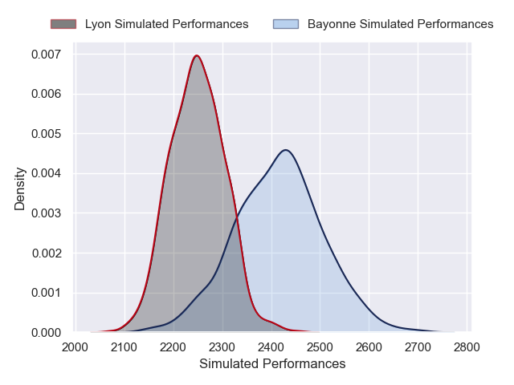
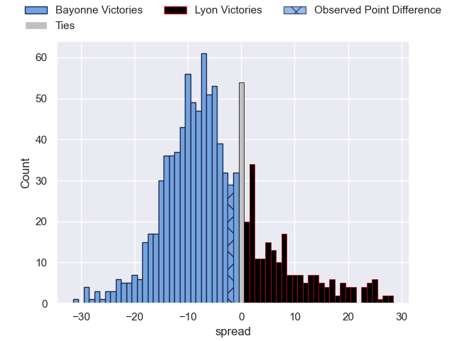

---  
layout: page  
title: Bayonne V Lyon on 2025/11/29  
date: 2025-11-29  
categories: "Top 14 25/26" match projection  
---
# Bayonne V Lyon on 2025/11/29, 22.0 to 20.0

# Club Level Predictions

Now that the game has been played, lets see how the club predictions did. I predicted Bayonne to win by 4.14, and Bayonne won by 2.0. That's an absolute error of 2.1 for the margin of victory, while my average absolute error has been 13.8 over the past six months. This prediction was more accurate than 88.3% of my recent predictions.

For the Over/Under model, I predicted a total of 56.5 and we have an actual total of 42.0. That's an absolute error of 14.5 compared to a six month average of 13.3. This prediction was more accurate than 36.7% of my recent predictions.
## Projected Performances - Club Model

## Projected Spreads - Club Model

## Projected Results - Club Model

