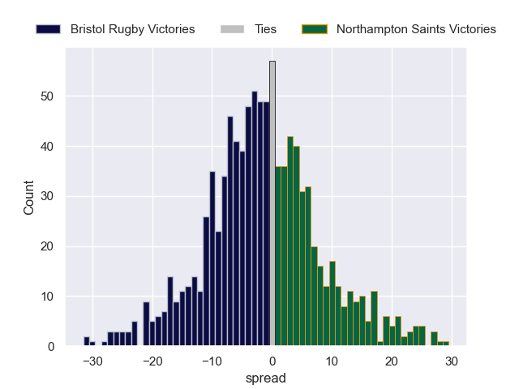

---  
layout: page  
title: Bristol Rugby V Northampton Saints on 2025/11/29  
date: 2025-11-29  
categories: "Gallagher Premiership 25/26" match projection  
---
# Bristol Rugby V Northampton Saints on 2025/11/29, 46.0 to 12.0

# Club Level Predictions

Now that the game has been played, lets see how the club predictions did. I predicted Bristol Rugby to win by 1.72, and Bristol Rugby won by 34.0. That's an absolute error of 32.3 for the margin of victory, while my average absolute error has been 13.9 over the past six months. This prediction was more accurate than 8.4% of my recent predictions.

For the Over/Under model, I predicted a total of 55.5 and we have an actual total of 58.0. That's an absolute error of 2.5 compared to a six month average of 13.1. This prediction was more accurate than 88.3% of my recent predictions.
## Projected Performances - Club Model

## Projected Spreads - Club Model

## Projected Results - Club Model

