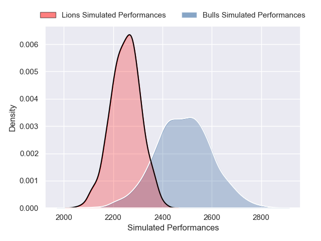
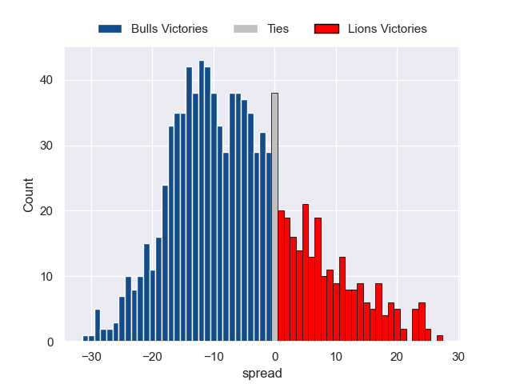

---  
layout: page  
title: Bulls V Lions on 2025/11/29  
date: 2025-11-29  
categories: "United Rugby Championship 25/26" match projection  
---
# Bulls V Lions on 2025/11/29, 33.0 to 43.0

# Club Level Predictions

Now that the game has been played, lets see how the club predictions did. I predicted Bulls to win by 6.12, and Lions won by 10.0. That's an absolute error of 16.1 for the margin of victory, while my average absolute error has been 13.9 over the past six months. This prediction was more accurate than 31.7% of my recent predictions.

For the Over/Under model, I predicted a total of 55.5 and we have an actual total of 76.0. That's an absolute error of 20.5 compared to a six month average of 13.1. This prediction was more accurate than 20.7% of my recent predictions.
## Projected Performances - Club Model

## Projected Spreads - Club Model

## Projected Results - Club Model

