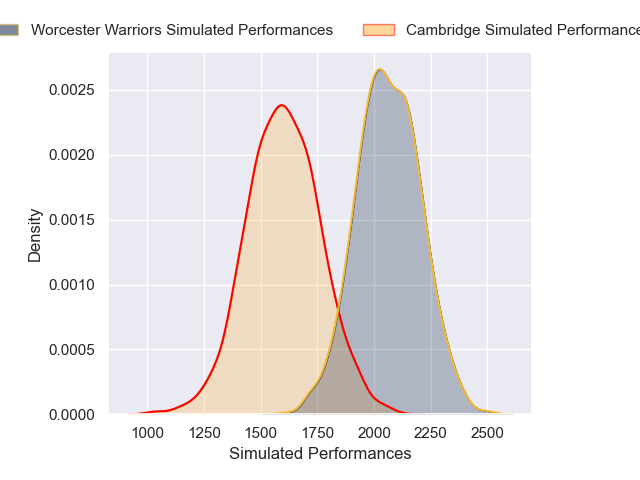
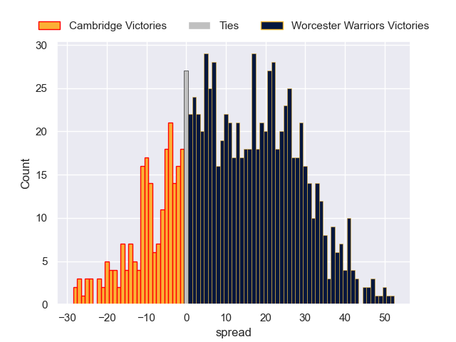

---  
layout: page  
title: Cambridge V Worcester Warriors on 2025/11/29  
date: 2025-11-29  
categories: "RFU Championship 25/26" match projection  
---
# Cambridge V Worcester Warriors on 2025/11/29, 14.0 to 61.0

# Club Level Predictions

Now that the game has been played, lets see how the club predictions did. I predicted Worcester Warriors to win by 13.44, and Worcester Warriors won by 47.0. That's an absolute error of 33.6 for the margin of victory, while my average absolute error has been 13.9 over the past six months. This prediction was more accurate than 7.6% of my recent predictions.

For the Over/Under model, I predicted a total of 78.5 and we have an actual total of 75.0. That's an absolute error of 3.5 compared to a six month average of 13.1. This prediction was more accurate than 83.2% of my recent predictions.
## Projected Performances - Club Model

## Projected Spreads - Club Model

## Projected Results - Club Model

