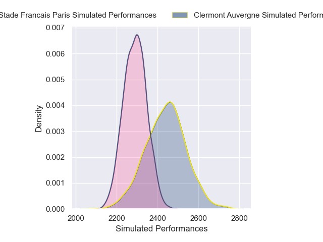
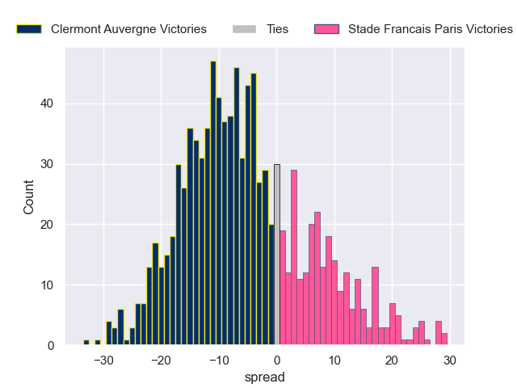

---  
layout: page  
title: Clermont Auvergne V Stade Francais Paris on 2025/11/29  
date: 2025-11-29  
categories: "Top 14 25/26" match projection  
---
# Clermont Auvergne V Stade Francais Paris on 2025/11/29, 36.0 to 32.0

# Club Level Predictions

Now that the game has been played, lets see how the club predictions did. I predicted Clermont Auvergne to win by 4.93, and Clermont Auvergne won by 4.0. That's an absolute error of 0.9 for the margin of victory, while my average absolute error has been 13.9 over the past six months. This prediction was more accurate than 95.3% of my recent predictions.

For the Over/Under model, I predicted a total of 49.5 and we have an actual total of 68.0. That's an absolute error of 18.5 compared to a six month average of 13.1. This prediction was more accurate than 25.6% of my recent predictions.
## Projected Performances - Club Model

## Projected Spreads - Club Model

## Projected Results - Club Model

