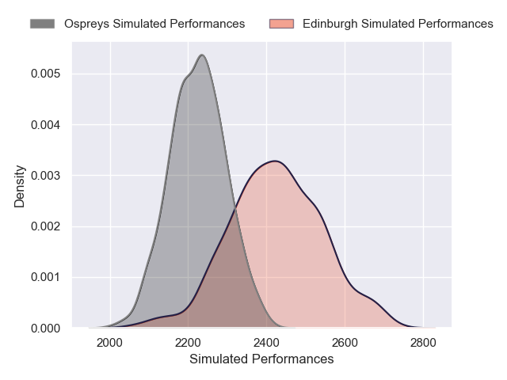
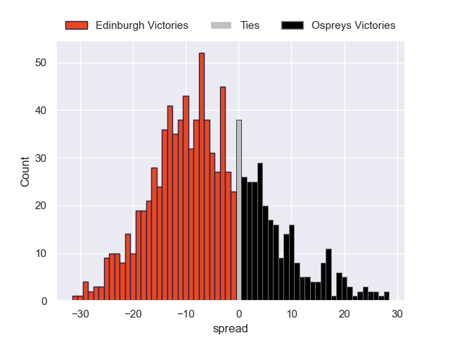

---  
layout: page  
title: Edinburgh V Ospreys on 2025/11/29  
date: 2025-11-29  
categories: "United Rugby Championship 25/26" match projection  
---
# Edinburgh V Ospreys on 2025/11/29, 19.0 to 17.0

# Club Level Predictions

Now that the game has been played, lets see how the club predictions did. I predicted Edinburgh to win by 5.42, and Edinburgh won by 2.0. That's an absolute error of 3.4 for the margin of victory, while my average absolute error has been 13.8 over the past six months. This prediction was more accurate than 82.3% of my recent predictions.

For the Over/Under model, I predicted a total of 47.5 and we have an actual total of 36.0. That's an absolute error of 11.5 compared to a six month average of 13.3. This prediction was more accurate than 47.9% of my recent predictions.
## Projected Performances - Club Model

## Projected Spreads - Club Model

## Projected Results - Club Model

