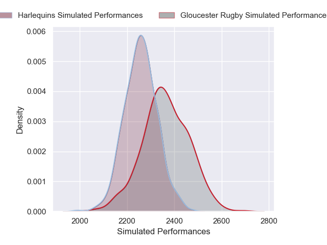
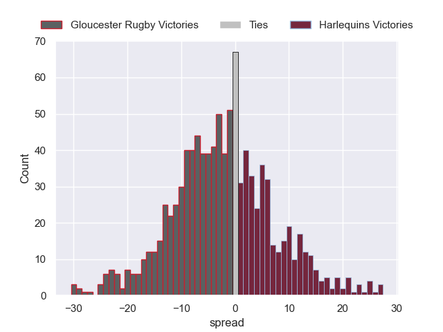

---  
layout: page  
title: Gloucester Rugby V Harlequins on 2025/11/29  
date: 2025-11-29  
categories: "Gallagher Premiership 25/26" match projection  
---
# Gloucester Rugby V Harlequins on 2025/11/29, 26.0 to 15.0

# Club Level Predictions

Now that the game has been played, lets see how the club predictions did. I predicted Gloucester Rugby to win by 1.58, and Gloucester Rugby won by 11.0. That's an absolute error of 9.4 for the margin of victory, while my average absolute error has been 13.9 over the past six months. This prediction was more accurate than 52.7% of my recent predictions.

For the Over/Under model, I predicted a total of 54.5 and we have an actual total of 41.0. That's an absolute error of 13.5 compared to a six month average of 13.1. This prediction was more accurate than 38.9% of my recent predictions.
## Projected Performances - Club Model

## Projected Spreads - Club Model

## Projected Results - Club Model

