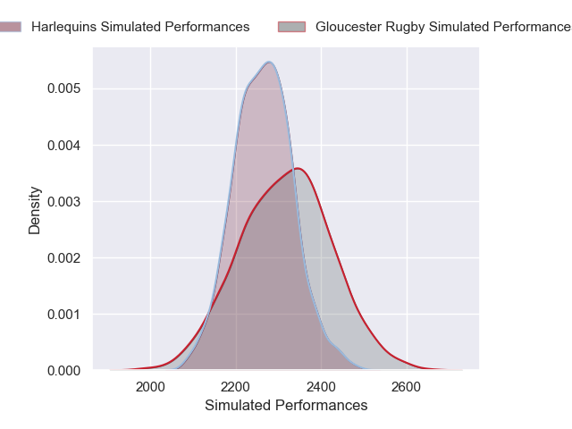
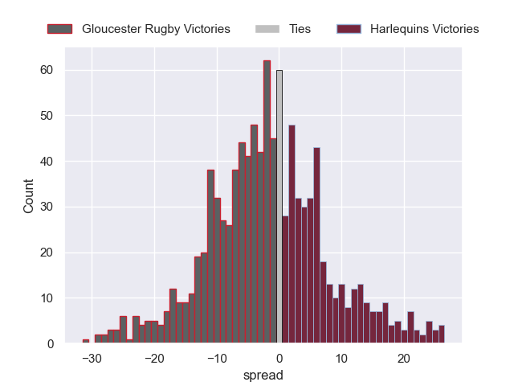

---  
layout: page  
title: Gloucester Rugby V Harlequins on 2025/11/29  
date: 2025-11-29  
categories: "Gallagher Premiership 25/26" match projection  
---
# Gloucester Rugby V Harlequins on 2025/11/29, 26.0 to 15.0

# Club Level Predictions

Now that the game has been played, lets see how the club predictions did. I predicted Gloucester Rugby to win by 1.74, and Gloucester Rugby won by 11.0. That's an absolute error of 9.3 for the margin of victory, while my average absolute error has been 13.8 over the past six months. This prediction was more accurate than 53.5% of my recent predictions.

For the Over/Under model, I predicted a total of 53.5 and we have an actual total of 41.0. That's an absolute error of 12.5 compared to a six month average of 13.3. This prediction was more accurate than 44.3% of my recent predictions.
## Projected Performances - Club Model

## Projected Spreads - Club Model

## Projected Results - Club Model

