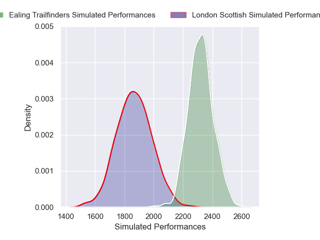

---  
layout: page  
title: London Scottish V Ealing Trailfinders on 2025/11/29  
date: 2025-11-29  
categories: "RFU Championship 25/26" match projection  
---
# London Scottish V Ealing Trailfinders on 2025/11/29, 14.0 to 38.0

# Club Level Predictions

Now that the game has been played, lets see how the club predictions did. I predicted Ealing Trailfinders to win by 13.5, and Ealing Trailfinders won by 24.0. That's an absolute error of 10.5 for the margin of victory, while my average absolute error has been 13.8 over the past six months. This prediction was more accurate than 48.2% of my recent predictions.

For the Over/Under model, I predicted a total of 66.5 and we have an actual total of 52.0. That's an absolute error of 14.5 compared to a six month average of 13.3. This prediction was more accurate than 36.7% of my recent predictions.
## Projected Performances - Club Model

## Projected Spreads - Club Model

## Projected Results - Club Model

