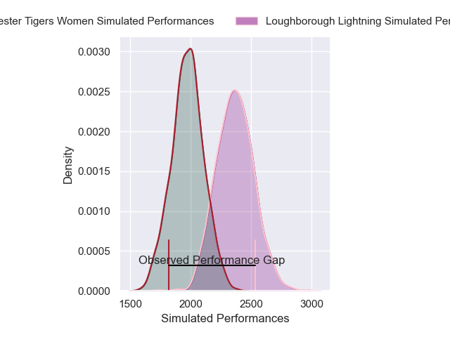
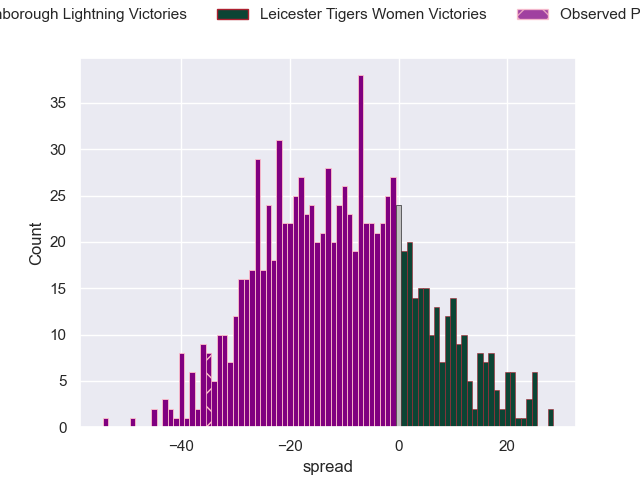

---  
layout: page  
title: Loughborough Lightning V Leicester Tigers Women on 2025/11/29  
date: 2025-11-29  
categories: "PWR 25/26" match projection  
---
# Loughborough Lightning V Leicester Tigers Women on 2025/11/29, 50.0 to 15.0

# Club Level Predictions

Now that the game has been played, lets see how the club predictions did. I predicted Loughborough Lightning to win by 10.74, and Loughborough Lightning won by 35.0. That's an absolute error of 24.3 for the margin of victory, while my average absolute error has been 13.9 over the past six months. This prediction was more accurate than 17.1% of my recent predictions.

For the Over/Under model, I predicted a total of 65.5 and we have an actual total of 65.0. That's an absolute error of 0.5 compared to a six month average of 13.1. This prediction was more accurate than 97.8% of my recent predictions.
## Projected Performances - Club Model

## Projected Spreads - Club Model

## Projected Results - Club Model

