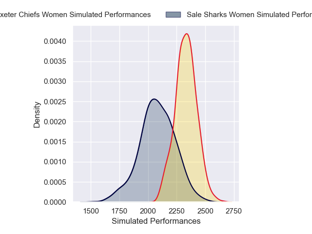
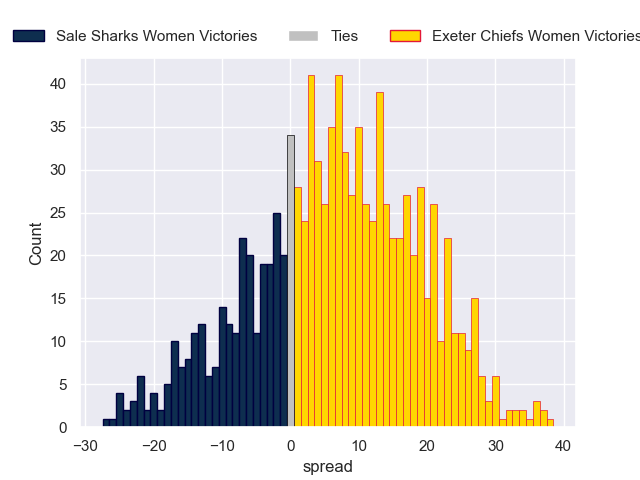
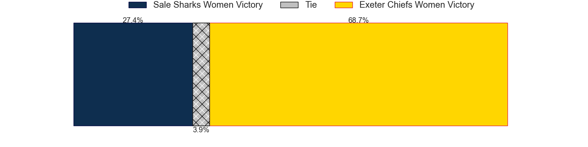

---  
layout: page  
title: Sale Sharks Women V Exeter Chiefs Women on 2025/11/29  
date: 2025-11-29  
categories: "PWR 25/26" match projection  
---
# Sale Sharks Women V Exeter Chiefs Women on 2025/11/29, 26.0 to 26.0

# Club Level Predictions

Now that the game has been played, lets see how the club predictions did. I predicted Exeter Chiefs Women to win by 6.75, and Exeter Chiefs Women won by 0.0. That's an absolute error of 6.8 for the margin of victory, while my average absolute error has been 13.9 over the past six months. This prediction was more accurate than 65.6% of my recent predictions.

For the Over/Under model, I predicted a total of 57.5 and we have an actual total of 52.0. That's an absolute error of 5.5 compared to a six month average of 13.1. This prediction was more accurate than 72.4% of my recent predictions.
## Projected Performances - Club Model

## Projected Spreads - Club Model

## Projected Results - Club Model

