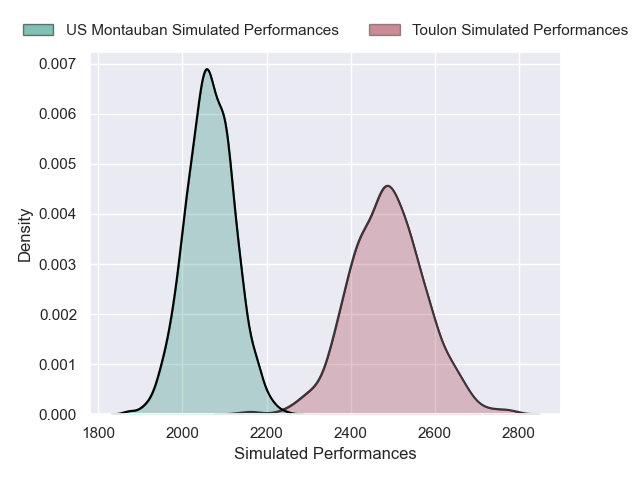
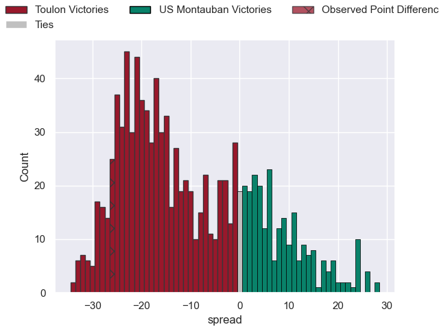

---  
layout: page  
title: Toulon V US Montauban on 2025/11/29  
date: 2025-11-29  
categories: "Top 14 25/26" match projection  
---
# Toulon V US Montauban on 2025/11/29, 54.0 to 28.0

# Club Level Predictions

Now that the game has been played, lets see how the club predictions did. I predicted Toulon to win by 11.26, and Toulon won by 26.0. That's an absolute error of 14.7 for the margin of victory, while my average absolute error has been 13.9 over the past six months. This prediction was more accurate than 35.8% of my recent predictions.

For the Over/Under model, I predicted a total of 54.5 and we have an actual total of 82.0. That's an absolute error of 27.5 compared to a six month average of 13.1. This prediction was more accurate than 9.7% of my recent predictions.
## Projected Performances - Club Model

## Projected Spreads - Club Model

## Projected Results - Club Model

