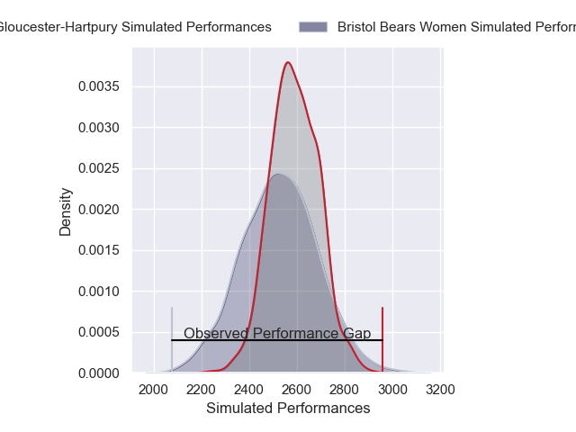
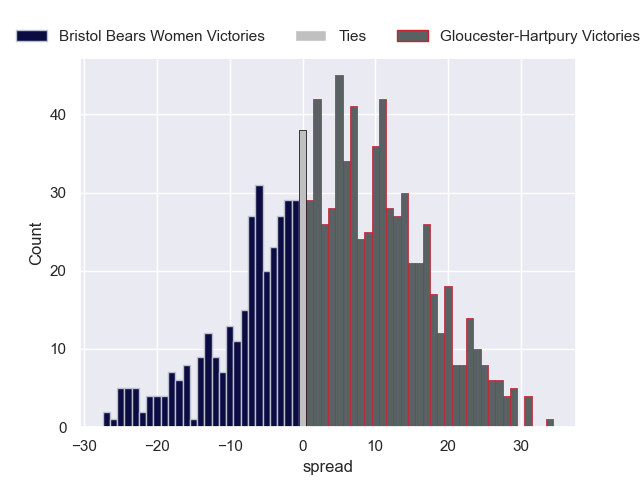

---  
layout: page  
title: Bristol Bears Women V Gloucester-Hartpury on 2025/11/30  
date: 2025-11-30  
categories: "PWR 25/26" match projection  
---
# Bristol Bears Women V Gloucester-Hartpury on 2025/11/30, 14.0 to 54.0

# Club Level Predictions

Now that the game has been played, lets see how the club predictions did. I predicted Gloucester-Hartpury to win by 1.78, and Gloucester-Hartpury won by 40.0. That's an absolute error of 38.2 for the margin of victory, while my average absolute error has been 13.9 over the past six months. This prediction was more accurate than 5.7% of my recent predictions.

For the Over/Under model, I predicted a total of 55.5 and we have an actual total of 68.0. That's an absolute error of 12.5 compared to a six month average of 13.1. This prediction was more accurate than 43.2% of my recent predictions.
## Projected Performances - Club Model

## Projected Spreads - Club Model

## Projected Results - Club Model

