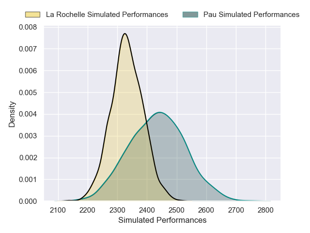
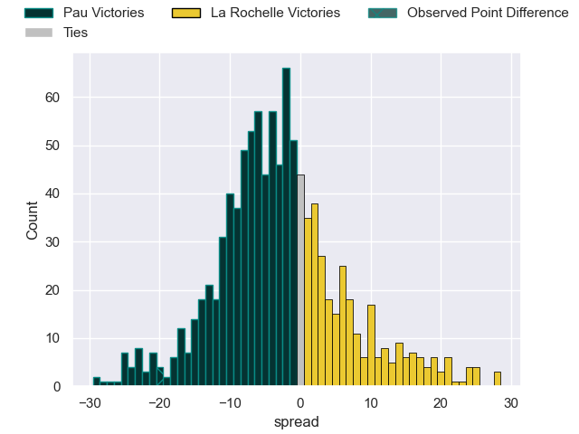
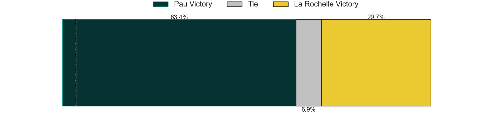

---  
layout: page  
title: Pau V La Rochelle on 2025/11/30  
date: 2025-11-30  
categories: "Top 14 25/26" match projection  
---
# Pau V La Rochelle on 2025/11/30, 53.0 to 33.0

# Club Level Predictions

Now that the game has been played, lets see how the club predictions did. I predicted Pau to win by 2.72, and Pau won by 20.0. That's an absolute error of 17.3 for the margin of victory, while my average absolute error has been 13.9 over the past six months. This prediction was more accurate than 29.2% of my recent predictions.

For the Over/Under model, I predicted a total of 47.5 and we have an actual total of 86.0. That's an absolute error of 38.5 compared to a six month average of 13.1. This prediction was more accurate than 2.8% of my recent predictions.
## Projected Performances - Club Model

## Projected Spreads - Club Model

## Projected Results - Club Model

