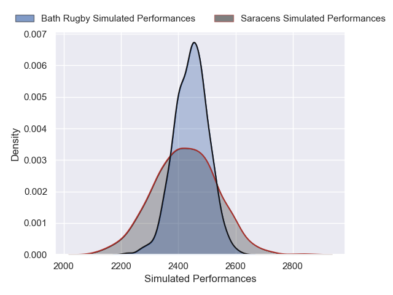

---  
layout: page  
title: Saracens V Bath Rugby on 2025/11/30  
date: 2025-11-30  
categories: "Gallagher Premiership 25/26" match projection  
---
# Saracens V Bath Rugby on 2025/11/30, 29.0 to 36.0

# Club Level Predictions

Now that the game has been played, lets see how the club predictions did. I predicted Bath Rugby to win by 0.71, and Bath Rugby won by 7.0. That's an absolute error of 6.3 for the margin of victory, while my average absolute error has been 13.9 over the past six months. This prediction was more accurate than 68.1% of my recent predictions.

For the Over/Under model, I predicted a total of 53.5 and we have an actual total of 65.0. That's an absolute error of 11.5 compared to a six month average of 13.1. This prediction was more accurate than 46.9% of my recent predictions.
## Projected Performances - Club Model

## Projected Spreads - Club Model

## Projected Results - Club Model

