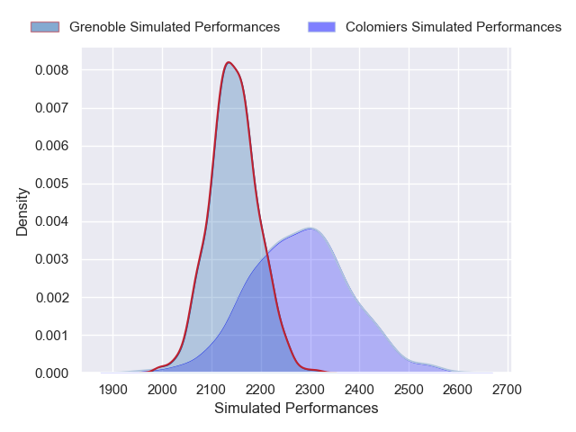
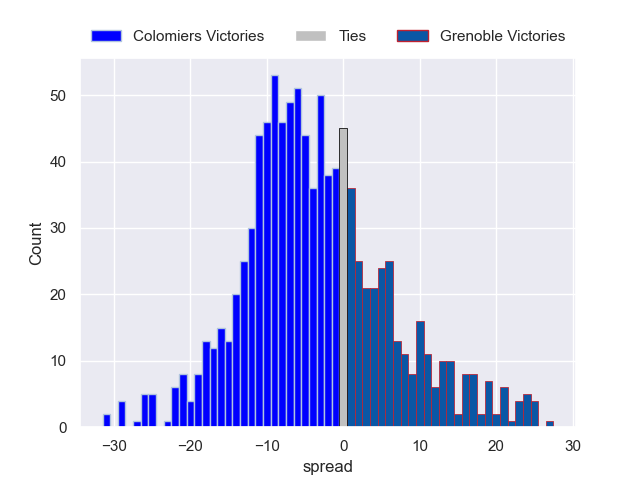

---  
layout: page  
title: Colomiers V Grenoble on 2025/12/04  
date: 2025-12-04  
categories: "Pro D2 25/26" match projection  
---
# Colomiers V Grenoble on 2025/12/04, 43.0 to 7.0

# Club Level Predictions

Now that the game has been played, lets see how the club predictions did. I predicted Colomiers to win by 3.78, and Colomiers won by 36.0. That's an absolute error of 32.2 for the margin of victory, while my average absolute error has been 13.8 over the past six months. This prediction was more accurate than 8.4% of my recent predictions.

For the Over/Under model, I predicted a total of 47.5 and we have an actual total of 50.0. That's an absolute error of 2.5 compared to a six month average of 13.0. This prediction was more accurate than 87.7% of my recent predictions.
## Projected Performances - Club Model

## Projected Spreads - Club Model

## Projected Results - Club Model

