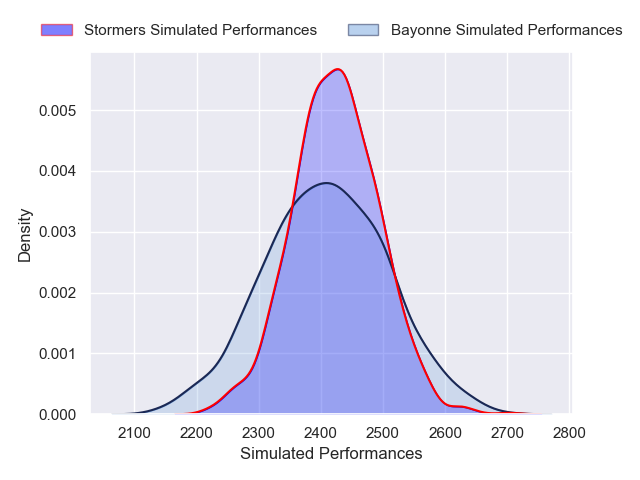
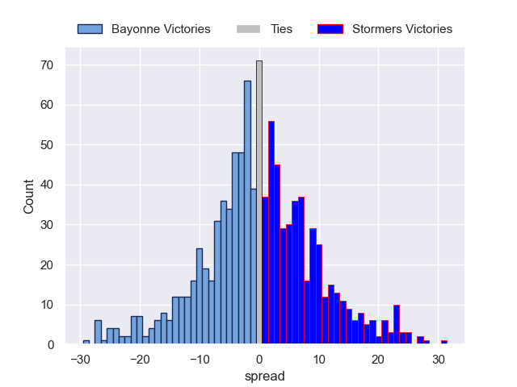

---  
layout: page  
title: Bayonne V Stormers on 2025/12/05  
date: 2025-12-05  
categories: "European Rugby Champions Cup 25/26" match projection  
---
# Bayonne V Stormers on 2025/12/05, 17.0 to 26.0

# Club Level Predictions

Now that the game has been played, lets see how the club predictions did. I predicted Bayonne to win by 0.27, and Stormers won by 9.0. That's an absolute error of 9.3 for the margin of victory, while my average absolute error has been 13.9 over the past six months. This prediction was more accurate than 53.6% of my recent predictions.

For the Over/Under model, I predicted a total of 53.5 and we have an actual total of 43.0. That's an absolute error of 10.5 compared to a six month average of 13.0. This prediction was more accurate than 50.1% of my recent predictions.
## Projected Performances - Club Model

## Projected Spreads - Club Model

## Projected Results - Club Model

