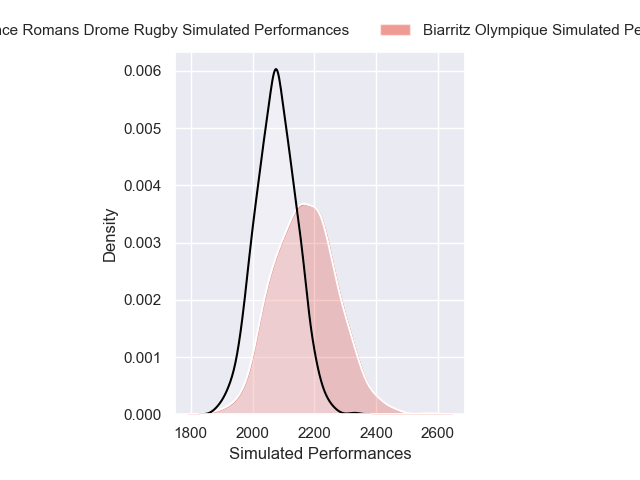
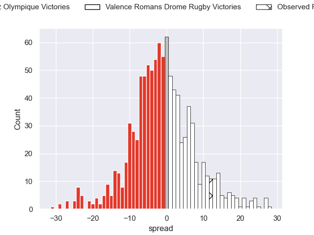
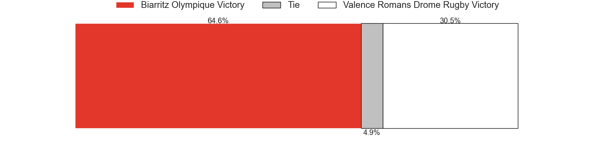

---  
layout: page  
title: Biarritz Olympique V Valence Romans Drome Rugby on 2025/12/05  
date: 2025-12-05  
categories: "Pro D2 25/26" match projection  
---
# Biarritz Olympique V Valence Romans Drome Rugby on 2025/12/05, 25.0 to 37.0

# Club Level Predictions

Now that the game has been played, lets see how the club predictions did. I predicted Biarritz Olympique to win by 1.36, and Valence Romans Drome Rugby won by 12.0. That's an absolute error of 13.4 for the margin of victory, while my average absolute error has been 13.8 over the past six months. This prediction was more accurate than 38.9% of my recent predictions.

For the Over/Under model, I predicted a total of 46.5 and we have an actual total of 62.0. That's an absolute error of 15.5 compared to a six month average of 13.0. This prediction was more accurate than 33.4% of my recent predictions.
## Projected Performances - Club Model

## Projected Spreads - Club Model

## Projected Results - Club Model

