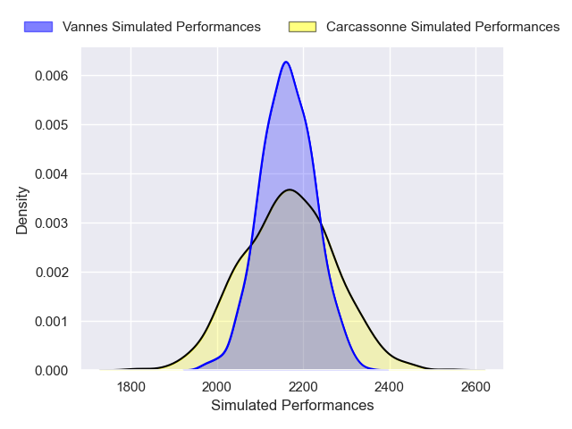
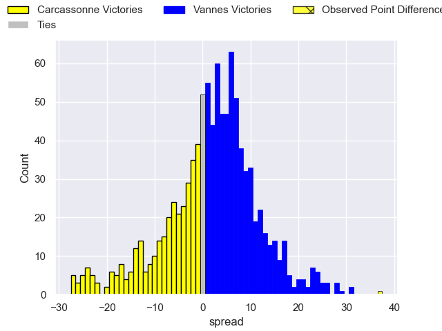

---  
layout: page  
title: Carcassonne V Vannes on 2025/12/05  
date: 2025-12-05  
categories: "Pro D2 25/26" match projection  
---
# Carcassonne V Vannes on 2025/12/05, 15.0 to 52.0

# Club Level Predictions

Now that the game has been played, lets see how the club predictions did. I predicted Vannes to win by 1.51, and Vannes won by 37.0. That's an absolute error of 35.5 for the margin of victory, while my average absolute error has been 13.8 over the past six months. This prediction was more accurate than 6.3% of my recent predictions.

For the Over/Under model, I predicted a total of 47.5 and we have an actual total of 67.0. That's an absolute error of 19.5 compared to a six month average of 13.0. This prediction was more accurate than 23.2% of my recent predictions.
## Projected Performances - Club Model

## Projected Spreads - Club Model

## Projected Results - Club Model

