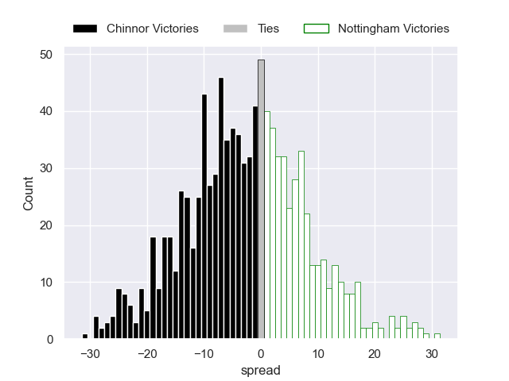

---  
layout: page  
title: Chinnor V Nottingham on 2025/12/05  
date: 2025-12-05  
categories: "RFU Championship 25/26" match projection  
---
# Chinnor V Nottingham on 2025/12/05, 6.0 to 11.0

# Club Level Predictions

Now that the game has been played, lets see how the club predictions did. I predicted Chinnor to win by 3.46, and Nottingham won by 5.0. That's an absolute error of 8.5 for the margin of victory, while my average absolute error has been 13.8 over the past six months. This prediction was more accurate than 57.4% of my recent predictions.

For the Over/Under model, I predicted a total of 53.5 and we have an actual total of 17.0. That's an absolute error of 36.5 compared to a six month average of 13.2. This prediction was more accurate than 3.5% of my recent predictions.
## Projected Performances - Club Model

## Projected Spreads - Club Model

## Projected Results - Club Model

