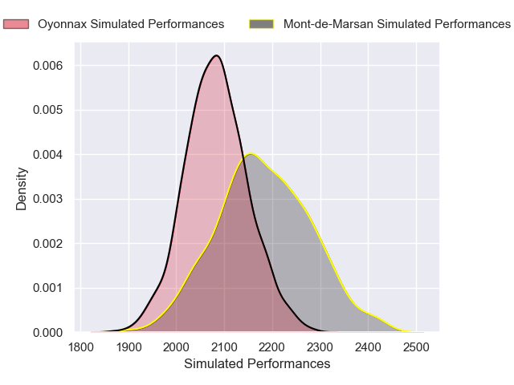
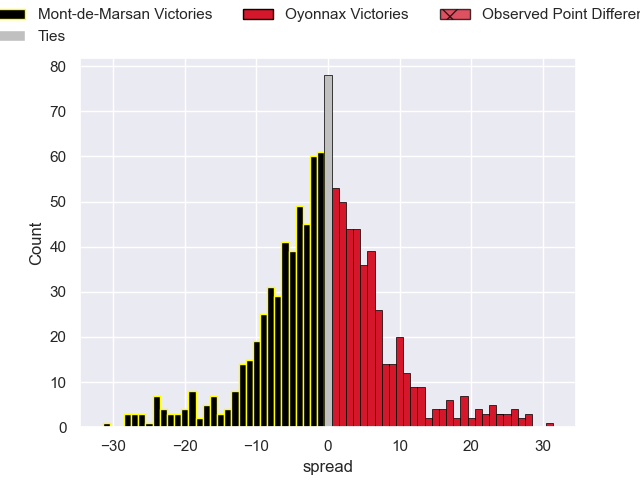

---  
layout: page  
title: Mont-de-Marsan V Oyonnax on 2025/12/05  
date: 2025-12-05  
categories: "Pro D2 25/26" match projection  
---
# Mont-de-Marsan V Oyonnax on 2025/12/05, 12.0 to 36.0

# Club Level Predictions

Now that the game has been played, lets see how the club predictions did. I predicted Mont-de-Marsan to win by 0.51, and Oyonnax won by 24.0. That's an absolute error of 24.5 for the margin of victory, while my average absolute error has been 13.8 over the past six months. This prediction was more accurate than 16.6% of my recent predictions.

For the Over/Under model, I predicted a total of 52.5 and we have an actual total of 48.0. That's an absolute error of 4.5 compared to a six month average of 13.0. This prediction was more accurate than 78.1% of my recent predictions.
## Projected Performances - Club Model

## Projected Spreads - Club Model

## Projected Results - Club Model

