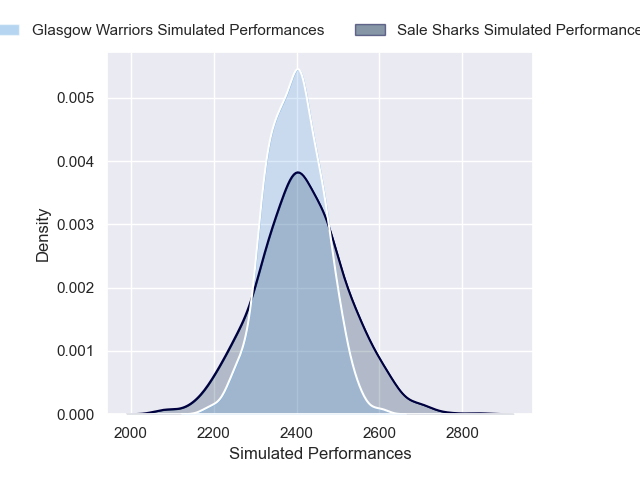
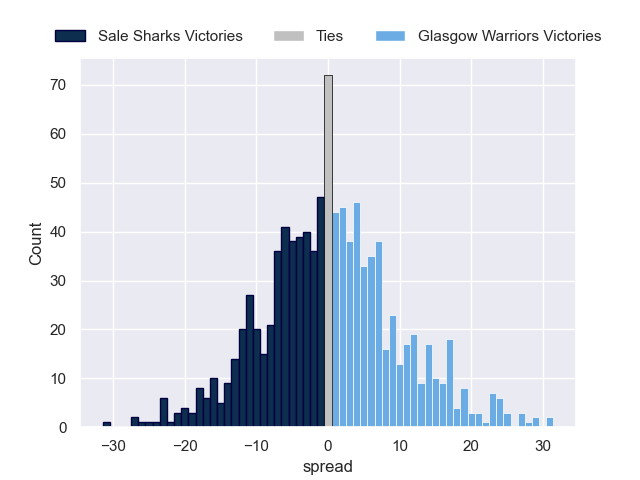

---  
layout: page  
title: Sale Sharks V Glasgow Warriors on 2025/12/05  
date: 2025-12-05  
categories: "European Rugby Champions Cup 25/26" match projection  
---
# Sale Sharks V Glasgow Warriors on 2025/12/05, 21.0 to 26.0

# Club Level Predictions

Now that the game has been played, lets see how the club predictions did. I predicted Sale Sharks to win by 0.84, and Glasgow Warriors won by 5.0. That's an absolute error of 5.8 for the margin of victory, while my average absolute error has been 13.8 over the past six months. This prediction was more accurate than 70.0% of my recent predictions.

For the Over/Under model, I predicted a total of 48.5 and we have an actual total of 47.0. That's an absolute error of 1.5 compared to a six month average of 13.2. This prediction was more accurate than 92.5% of my recent predictions.
## Projected Performances - Club Model

## Projected Spreads - Club Model

## Projected Results - Club Model

