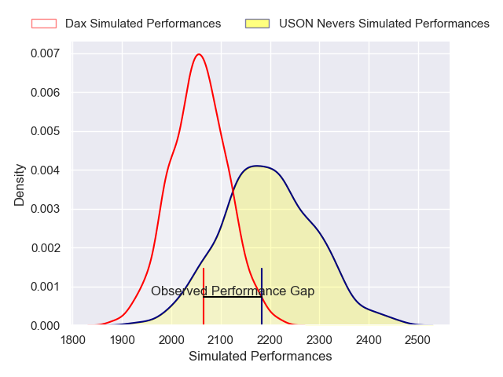
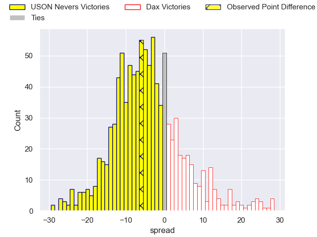
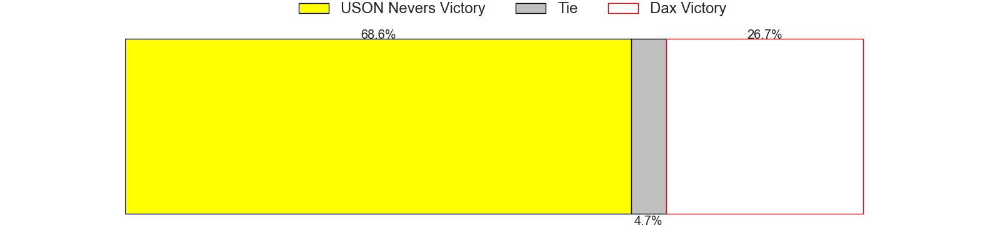

---  
layout: page  
title: USON Nevers V Dax on 2025/12/05  
date: 2025-12-05  
categories: "Pro D2 25/26" match projection  
---
# USON Nevers V Dax on 2025/12/05, 32.0 to 26.0

# Club Level Predictions

Now that the game has been played, lets see how the club predictions did. I predicted USON Nevers to win by 4.3, and USON Nevers won by 6.0. That's an absolute error of 1.7 for the margin of victory, while my average absolute error has been 13.8 over the past six months. This prediction was more accurate than 90.3% of my recent predictions.

For the Over/Under model, I predicted a total of 47.5 and we have an actual total of 58.0. That's an absolute error of 10.5 compared to a six month average of 13.2. This prediction was more accurate than 51.1% of my recent predictions.
## Projected Performances - Club Model

## Projected Spreads - Club Model

## Projected Results - Club Model

