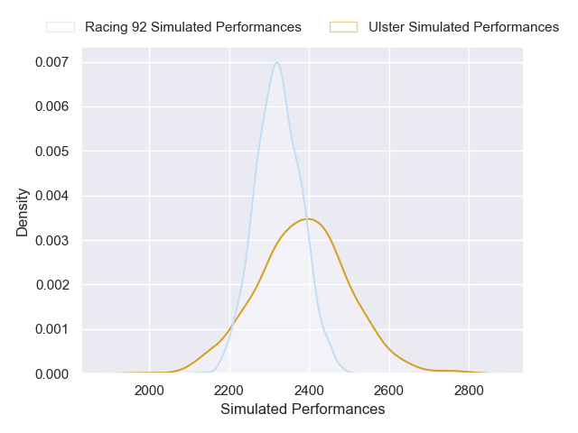
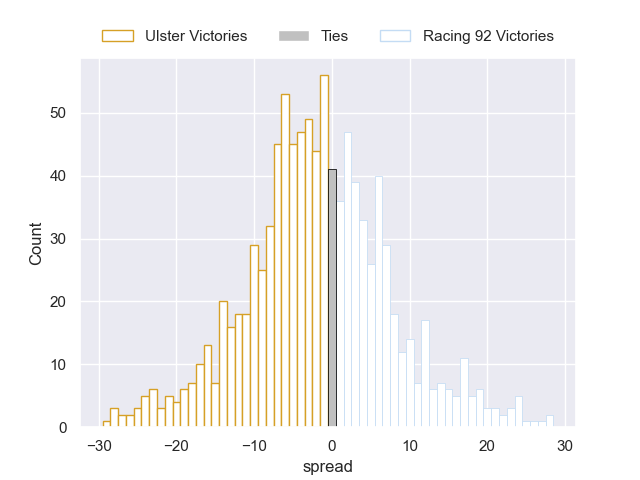

---  
layout: page  
title: Ulster V Racing 92 on 2025/12/05  
date: 2025-12-05  
categories: "European Rugby Challenge Cup 25/26" match projection  
---
# Ulster V Racing 92 on 2025/12/05, 61.0 to 7.0

# Club Level Predictions

Now that the game has been played, lets see how the club predictions did. I predicted Ulster to win by 3.46, and Ulster won by 54.0. That's an absolute error of 50.5 for the margin of victory, while my average absolute error has been 13.9 over the past six months. This prediction was more accurate than 1.8% of my recent predictions.

For the Over/Under model, I predicted a total of 56.5 and we have an actual total of 68.0. That's an absolute error of 11.5 compared to a six month average of 13.0. This prediction was more accurate than 46.5% of my recent predictions.
## Projected Performances - Club Model

## Projected Spreads - Club Model

## Projected Results - Club Model

