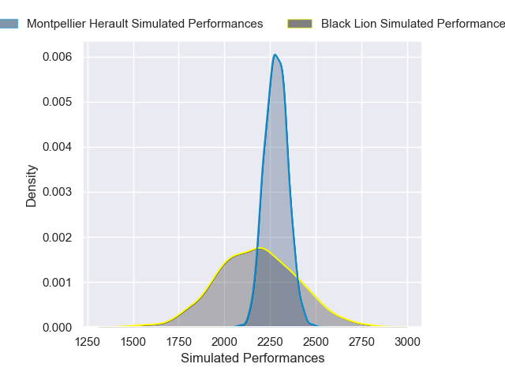

---  
layout: page  
title: Black Lion V Montpellier Herault on 2025/12/06  
date: 2025-12-06  
categories: "European Rugby Challenge Cup 25/26" match projection  
---
# Black Lion V Montpellier Herault on 2025/12/06, 13.0 to 24.0

# Club Level Predictions

Now that the game has been played, lets see how the club predictions did. I predicted Montpellier Herault to win by 3.72, and Montpellier Herault won by 11.0. That's an absolute error of 7.3 for the margin of victory, while my average absolute error has been 13.9 over the past six months. This prediction was more accurate than 63.9% of my recent predictions.

For the Over/Under model, I predicted a total of 53.5 and we have an actual total of 37.0. That's an absolute error of 16.5 compared to a six month average of 13.0. This prediction was more accurate than 29.7% of my recent predictions.
## Projected Performances - Club Model

## Projected Spreads - Club Model

## Projected Results - Club Model

