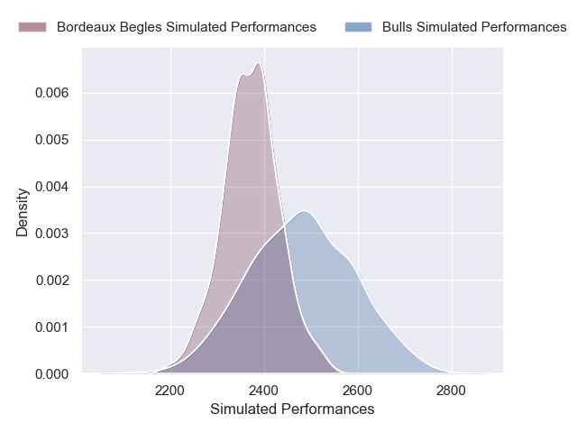
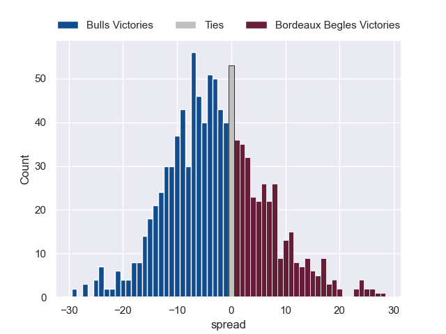

---  
layout: page  
title: Bulls V Bordeaux Begles on 2025/12/06  
date: 2025-12-06  
categories: "European Rugby Champions Cup 25/26" match projection  
---
# Bulls V Bordeaux Begles on 2025/12/06, 33.0 to 46.0

# Club Level Predictions

Now that the game has been played, lets see how the club predictions did. I predicted Bulls to win by 2.75, and Bordeaux Begles won by 13.0. That's an absolute error of 15.8 for the margin of victory, while my average absolute error has been 13.9 over the past six months. This prediction was more accurate than 32.8% of my recent predictions.

For the Over/Under model, I predicted a total of 58.5 and we have an actual total of 79.0. That's an absolute error of 20.5 compared to a six month average of 13.0. This prediction was more accurate than 20.7% of my recent predictions.
## Projected Performances - Club Model

## Projected Spreads - Club Model

## Projected Results - Club Model

