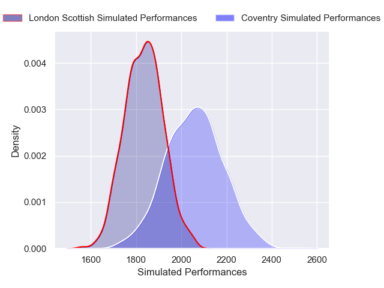
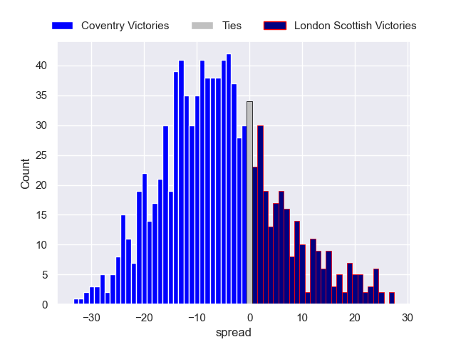

---  
layout: page  
title: Coventry V London Scottish on 2025/12/06  
date: 2025-12-06  
categories: "RFU Championship 25/26" match projection  
---
# Coventry V London Scottish on 2025/12/06, 61.0 to 10.0

# Club Level Predictions

Now that the game has been played, lets see how the club predictions did. I predicted Coventry to win by 8.9, and Coventry won by 51.0. That's an absolute error of 42.1 for the margin of victory, while my average absolute error has been 13.9 over the past six months. This prediction was more accurate than 3.7% of my recent predictions.

For the Over/Under model, I predicted a total of 59.5 and we have an actual total of 71.0. That's an absolute error of 11.5 compared to a six month average of 13.0. This prediction was more accurate than 46.5% of my recent predictions.
## Projected Performances - Club Model

## Projected Spreads - Club Model

## Projected Results - Club Model

