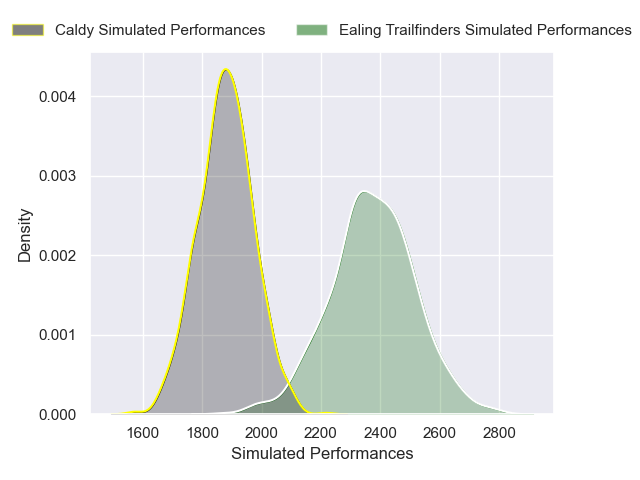

---  
layout: page  
title: Ealing Trailfinders V Caldy on 2025/12/06  
date: 2025-12-06  
categories: "RFU Championship 25/26" match projection  
---
# Ealing Trailfinders V Caldy on 2025/12/06, 38.0 to 0.0

# Club Level Predictions

Now that the game has been played, lets see how the club predictions did. I predicted Ealing Trailfinders to win by 14.74, and Ealing Trailfinders won by 38.0. That's an absolute error of 23.3 for the margin of victory, while my average absolute error has been 13.9 over the past six months. This prediction was more accurate than 18.8% of my recent predictions.

For the Over/Under model, I predicted a total of 56.5 and we have an actual total of 38.0. That's an absolute error of 18.5 compared to a six month average of 13.0. This prediction was more accurate than 25.3% of my recent predictions.
## Projected Performances - Club Model

## Projected Spreads - Club Model

## Projected Results - Club Model

