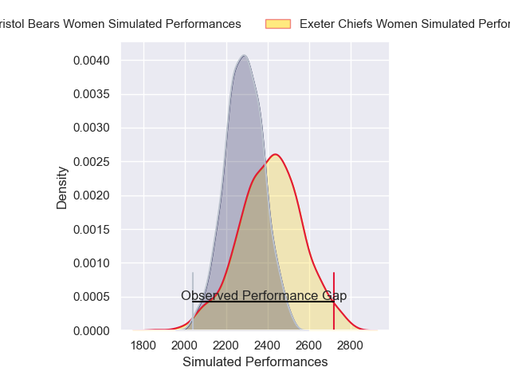
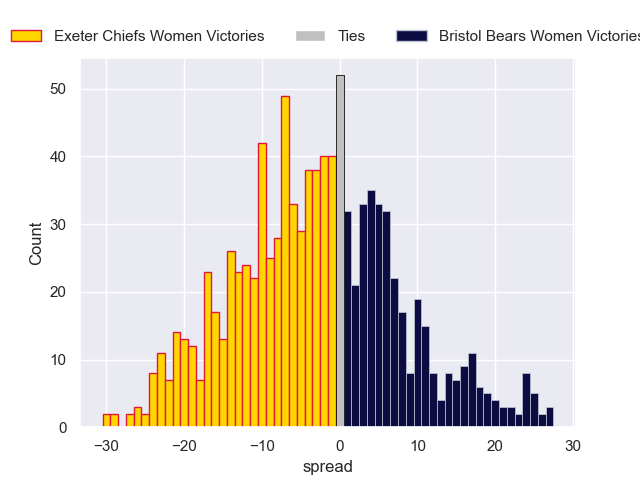

---  
layout: page  
title: Exeter Chiefs Women V Bristol Bears Women on 2025/12/06  
date: 2025-12-06  
categories: "PWR 25/26" match projection  
---
# Exeter Chiefs Women V Bristol Bears Women on 2025/12/06, 41.0 to 10.0

# Club Level Predictions

Now that the game has been played, lets see how the club predictions did. I predicted Exeter Chiefs Women to win by 3.86, and Exeter Chiefs Women won by 31.0. That's an absolute error of 27.1 for the margin of victory, while my average absolute error has been 13.9 over the past six months. This prediction was more accurate than 13.2% of my recent predictions.

For the Over/Under model, I predicted a total of 53.5 and we have an actual total of 51.0. That's an absolute error of 2.5 compared to a six month average of 13.0. This prediction was more accurate than 87.6% of my recent predictions.
## Projected Performances - Club Model

## Projected Spreads - Club Model

## Projected Results - Club Model

