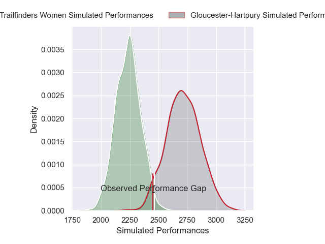
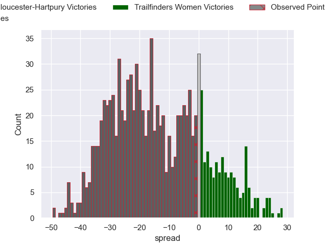

---  
layout: page  
title: Gloucester-Hartpury V Trailfinders Women on 2025/12/06  
date: 2025-12-06  
categories: "PWR 25/26" match projection  
---
# Gloucester-Hartpury V Trailfinders Women on 2025/12/06, 29.0 to 28.0

# Club Level Predictions

Now that the game has been played, lets see how the club predictions did. I predicted Gloucester-Hartpury to win by 13.78, and Gloucester-Hartpury won by 1.0. That's an absolute error of 12.8 for the margin of victory, while my average absolute error has been 13.8 over the past six months. This prediction was more accurate than 40.9% of my recent predictions.

For the Over/Under model, I predicted a total of 59.5 and we have an actual total of 57.0. That's an absolute error of 2.5 compared to a six month average of 13.2. This prediction was more accurate than 87.3% of my recent predictions.
## Projected Performances - Club Model

## Projected Spreads - Club Model

## Projected Results - Club Model

