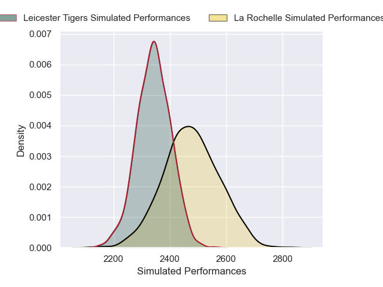
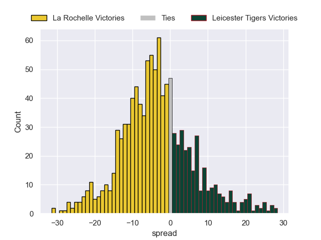

---  
layout: page  
title: La Rochelle V Leicester Tigers on 2025/12/06  
date: 2025-12-06  
categories: "European Rugby Champions Cup 25/26" match projection  
---
# La Rochelle V Leicester Tigers on 2025/12/06, 39.0 to 20.0

# Club Level Predictions

Now that the game has been played, lets see how the club predictions did. I predicted La Rochelle to win by 3.74, and La Rochelle won by 19.0. That's an absolute error of 15.3 for the margin of victory, while my average absolute error has been 13.9 over the past six months. This prediction was more accurate than 34.7% of my recent predictions.

For the Over/Under model, I predicted a total of 53.5 and we have an actual total of 59.0. That's an absolute error of 5.5 compared to a six month average of 13.0. This prediction was more accurate than 72.1% of my recent predictions.
## Projected Performances - Club Model

## Projected Spreads - Club Model

## Projected Results - Club Model

