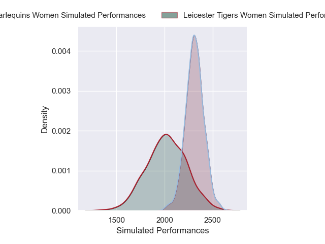
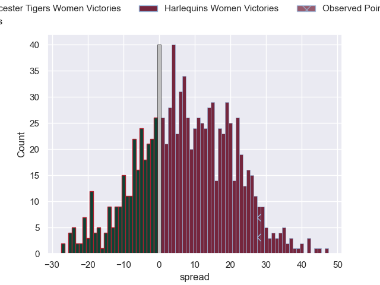

---  
layout: page  
title: Leicester Tigers Women V Harlequins Ladies on 2025/12/06  
date: 2025-12-06  
categories: "PWR 25/26" match projection  
---
# Leicester Tigers Women V Harlequins Ladies on 2025/12/06, 28.0 to 56.0

# Club Level Predictions

Now that the game has been played, lets see how the club predictions did. I predicted Harlequins Women to win by 7.84, and Harlequins Women won by 28.0. That's an absolute error of 20.2 for the margin of victory, while my average absolute error has been 13.8 over the past six months. This prediction was more accurate than 24.2% of my recent predictions.

For the Over/Under model, I predicted a total of 60.5 and we have an actual total of 84.0. That's an absolute error of 23.5 compared to a six month average of 13.0. This prediction was more accurate than 15.3% of my recent predictions.
## Projected Performances - Club Model

## Projected Spreads - Club Model

## Projected Results - Club Model

